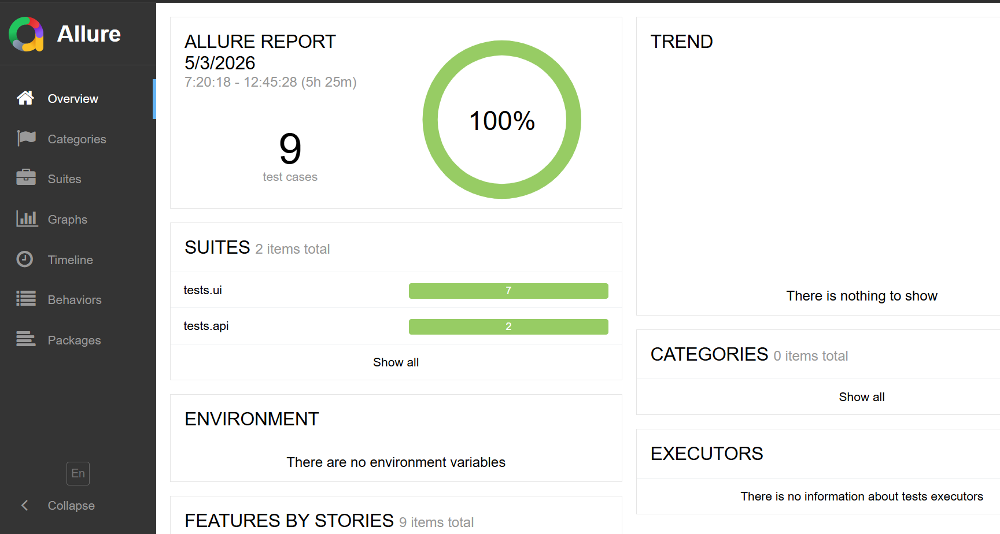

[](https://github.com/UdhayaSelvan/autoqa-pipeline/actions/workflows/ci.yml)

# AutoQA Pipeline

End-to-end QA automation pipeline using Python, Selenium, Pytest, REST API testing, and GitHub Actions with Allure reporting.

---

## 🚀 Tech Stack

- Python
- Pytest
- Selenium WebDriver (POM)
- REST API testing (requests)
- Allure Reports
- GitHub Actions (CI/CD)

---

## ✅ Features

- UI automation using Page Object Model (POM)
- API testing with request validation
- Data-driven testing using CSV + pytest parametrization
- CI pipeline triggered on every push
- Allure reporting with downloadable artifacts

---

## 📊 Test Report (Allure)



---

## ⚙️ Run Locally

```bash
pip install -r requirements.txt
pytest
allure serve allure-results